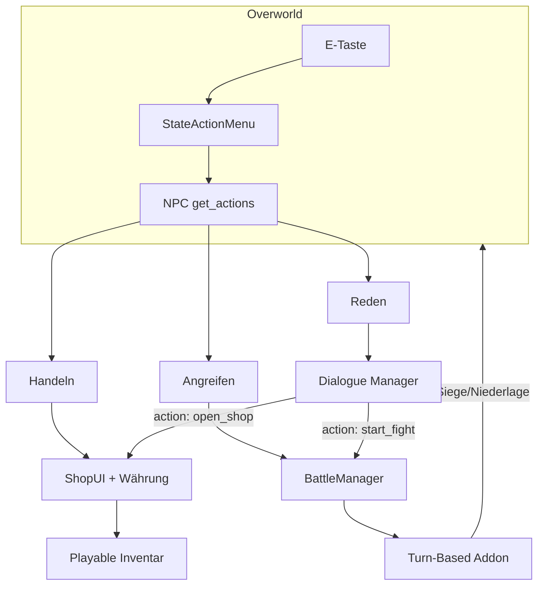

# NPC-System: Reden, Handeln, Kämpfen

## Ausgangslage im Projekt

Euer Fundament ist bereits gut vorbereitet:

- **Interaktion:** [`Scripts/stateActionMenu.gd`](Scripts/stateActionMenu.gd) sammelt alle Nodes in Gruppe `"interactable"` im Radius 1,5 m und ruft `get_actions()` / `perform_action()` auf — exakt das Muster aus [`Systems/Interaction/Interactable.gd`](Systems/Interaction/Interactable.gd).
- **Charaktere:** [`Charaktere/Playable.gd`](Charaktere/Playable.gd) hat Stats, Inventar (`Item`-Resources), Equipment und `take_damage()`.
- **NPC-Stub:** [`Charaktere/NPC/NPC.gd`](Charaktere/NPC/NPC.gd) erweitert `Playable`, hat aber noch keine Interaktion.
- **Kampf:** [`Scripts/stateAttack.gd`](Scripts/stateAttack.gd) ist Echtzeit-Overworld — für eure Wahl **rundenbasiert** nicht verwenden. Hitbox/Hurtbox bleiben für Props/Weltobjekte.

Physics-Layer **NPC (9)** ist in [`project.godot`](project.godot) schon definiert.



---

## Empfohlene Addons (Godot Asset Library / Store)

### 1. Dialog — **Dialogue Manager** (primäre Empfehlung)

- **Asset:** [Dialogue Manager](https://store.godotengine.org/asset/nathanhoad/dialogue-manager/) (Godot 4.4+, läuft mit 4.6)
- **Warum:** Reif, aktiv gepflegt, GDScript, stateless Runtime (euer Spiel bleibt Autorität für Inventar/Flags), branching Dialoge, Übersetzungen, `do`-Actions für Shop/Kampf-Trigger
- **Alternative:** [Parley](https://github.com/bisterix-studio/parley) — graph-basierter Editor, gut für Writer; weniger Community-Ökosystem als Dialogue Manager

### 2. Rundenbasierter Kampf — **Turn-Based-System-Plugin** (primäre Empfehlung)

- **Asset:** [derdrache/Turn-Based-System-Plugin](https://github.com/derdrache/Turn-Based-System-Plugin) (GDScript, Godot 4.x)
- **Warum:** Passt zu eurem **GDScript**-Projekt; liefert Turn-Controller, Command-Menü, Targeting, Turn-Order-Bar, Character-Resources — genau was ihr für JRPG-Kämpfe braucht
- **Alternative (experimentell):** [JRPG turn-based combat addon](https://github.com/LeviOS31/JRPG-turn-based-combat-addon-Godot) — explizit für Godot **4.6**, aber noch in Entwicklung (v0.2)
- **Nicht empfohlen:** TurnBasedSystem (C#) — euer Projekt ist GDScript
- **Referenz:** [Turn Based Combat (3D)](https://godotengine.org/asset-library/asset/...) Template (4.1) nur als Inspirationsquelle für 3D-Kampfszene

### 3. Handel — **kein Addon nötig** (Empfehlung)

- Euer [`Item`](Ressources/Items/) + [`Playable.add_item/remove_item`](Charaktere/Playable.gd) + [`UI/Inventory/InventoryUI.gd`](UI/Inventory/InventoryUI.gd) sind bereits da
- Addons wie **Universal Inventory System** oder **Pandora+ Premium** würden das Inventar ersetzen/migrieren — hoher Aufwand, geringer Mehrwert für euren Stand
- **Pandora+ Premium** ([itch.io](https://trobugno.itch.io/pandora-plus-premium)) lohnt sich nur, wenn ihr später **Quests, Factions, komplexe Wirtschaft und Combat-Rechner** als Gesamtpaket wollt — dann aber mit bewusster Migration weg vom eigenen Item-System

### 4. Overworld-KI — **optional, später**

- Für stehende Händler/Quest-NPCs reicht Idle-Animation + kein AI-Addon
- **LimboAI** ([Asset Library](https://godotengine.org/asset-library/asset/4852), Godot 4.6) oder **Beehave** nur wenn NPCs patrouillieren/suchen sollen — **nicht beide gleichzeitig** (Namenskonflikte)

---

## Integrations-Empfehlung: „Erweitern statt Ersetzen“

| Bereich | Vorgehen |
|---------|----------|
| Dialog | Addon (Dialogue Manager) |
| Handel | Eigene schlanke ShopUI + `gold` auf `Playable` |
| Kampf | Addon (Turn-Based-Plugin) + Adapter zu `Playable`-Stats |
| NPC-Menü | Eigene `get_actions()` — kein Addon |

Das minimiert Migration und nutzt euer bestehendes E-Menü als einheitlichen Einstieg.

---

## Umsetzung in Phasen

### Phase 1: NPC als Interaktionsziel

Neue Datei z.B. [`Charaktere/NPC/npc_interaction.gd`](Charaktere/NPC/npc_interaction.gd) als Child-Node am NPC (Analogie zu `Interactions` beim Spieler):

```gdscript
# Konzept — Child-Node am NPC, in Gruppe "interactable"
func get_actions(player: Playable) -> Array[Dictionary]:
    var actions: Array[Dictionary] = [{"label": "Reden", "action_id": "talk"}]
    if _data.can_trade and not _data.is_defeated:
        actions.append({"label": "Handeln", "action_id": "trade"})
    if _data.can_fight and not _data.is_defeated:
        actions.append({"label": "Angreifen", "action_id": "fight"})
    return actions
```

- **Resource** `NPCData` (`.tres`): `character_name`, `dialogue_file`, `dialogue_start`, `shop_inventory`, `encounter_id`, `can_trade`, `can_fight`, `defeated_flag`
- [`Charaktere/NPC/TestNPC.tscn`](Charaktere/NPC/TestNPC.tscn) erweitern: Collision, `npc_interaction`, optional GLTF-Modell wie Dannerman
- NPC-Szene erbt von [`NPC.gd`](Charaktere/NPC/NPC.gd), Interaction-Node delegiert an Autoloads

### Phase 2: Dialogue Manager einbinden

1. Addon installieren, Plugin aktivieren, Autoload `DialogueManager` (Standard-Setup)
2. Pro NPC eine `.dialogue`-Datei, z.B. `dialogues/haendler_01.dialogue`
3. **DialogueBalloon**-Szene ins HUD einhängen (oder eigene UI im FF-Stil)
4. Beim Start: Spieler-Input sperren (`Player` State Machine → Idle, `process_mode` oder Flag `dialogue_active`)
5. **Mutations/Actions** in Dialogen:
   - `do open_shop("haendler_01")` → ShopUI
   - `do start_encounter("bandit_01")` → BattleManager
   - `set defeated_haendler = true` → GlobalState/Blackboard

Bridge-Script z.B. [`Systems/Dialogue/game_dialogue_bridge.gd`](Systems/Dialogue/game_dialogue_bridge.gd):

```gdscript
func open_shop(shop_id: String) -> void:
    ShopManager.open(shop_id, get_current_player())

func start_encounter(encounter_id: String) -> void:
    BattleManager.start(encounter_id, Party.get_active_members())
```

### Phase 3: Handel (eigenes System)

1. `Playable` um `@export var gold: int` erweitern (oder zentral in [`Globals/`](Globals/))
2. **ShopUI** (`UI/Shop/shop_ui.tscn`): zwei Listen (Händler / Spieler), Preise aus `Item`-Resource oder `ShopEntry`-Resource `{ item, buy_price, sell_price, stock }`
3. **ShopManager** Autoload: lädt Shop-Daten, prüft Gold + Inventarplatz, ruft `add_item` / `remove_item`
4. `perform_action("trade")` → `ShopManager.open(npc_data.shop_id, player)`
5. Optional: Handeln auch direkt aus Dialog (`do open_shop(...)`) ohne E-Menü-Eintrag

### Phase 4: Rundenbasierter Kampf

1. **Turn-Based-System-Plugin** installieren
2. **BattleManager** Autoload + Kampfszene `Scenes/Battle/battle_scene.tscn`:
   - Lädt Encounter-Resource (Gegner-Liste, Hintergrund, Musik)
   - Spawnt Party-Mitglieder aus [`Charaktere/Party/party.gd`](Charaktere/Party/party.gd) als `TurnBasedAgent`
3. **Adapter** `battle_character_factory.gd`:
   - `Playable.max_health/health/mana/skills/equipment` → Turn-Based `CharacterResource`
   - Nach Kampf: HP/MP zurück auf Overworld-`Playable` schreiben
4. **Encounter starten** aus E-Menü `"fight"` oder Dialog-Action
5. **Ergebnis:**
   - Sieg: Loot/Gold, NPC `is_defeated = true`, Dialog-Zweig „Du hast mich besiegt“
   - Niederlage: Game Over oder Flucht — Designentscheidung festlegen
6. Overworld während Kampf pausieren (`get_tree().paused` oder Szene wechseln zu dedizierter Battle-Scene)

### Phase 5: NPC-Typen und Content

| NPC-Typ | E-Menü | Dialog | Shop | Kampf |
|---------|--------|--------|------|-------|
| Händler | Reden, Handeln | Preise, Flavor | ja | nein |
| Questgeber | Reden | Quest-Flags | nein | optional |
| Gegner | Reden, Angreifen | Warnung | nein | ja |
| Neutral | Reden | Smalltalk | nein | nur wenn provoziert |

---

## Wichtige Anpassungen an bestehendem Code

- [`Scripts/stateActionMenu.gd`](Scripts/stateActionMenu.gd): Kein Umbau nötig — NPCs registrieren sich nur in `"interactable"`
- [`Charaktere/player.gd`](Charaktere/Playable.gd): Flag `can_interact` während Dialog/Shop/Kampf
- [`Charaktere/Party/party.gd`](Charaktere/Party/party.gd): Party-Mitglieder für Kampf exportieren (Leader + Follower)
- [`StateAttack`](Scripts/stateAttack.gd): Für NPC-Kämpfe **nicht** anbinden; optional später für Overworld-Props behalten

---

## Risiken und Abwägungen

- **Turn-Based-Plugin vs. JRPG-Addon:** Plugin ist stabiler/umfangreicher; JRPG-Addon ist 4.6-nativ aber jung — Prototyp mit Plugin, ggf. später wechseln
- **Dialog während E-Menü:** Nach `perform_action("talk")` muss StateActionMenu sauber schließen bevor Dialog startet (bereits via `_action_done`)
- **3D-Kampfszene:** Addon liefert Logik/UI; ihr braucht eigene 3D-Stage (Kamera, Charakter-Platzhalter) — [`Turn Based Combat (3D)`](https://godotengine.org/asset-library/asset/) als Referenz
- **Pandora+:** Erst evaluieren wenn Quest-/Faction-System wächst; nicht für MVP

---

## Empfohlene Reihenfolge (MVP)

1. NPC-Interaction + TestNPC mit „Reden“ (Dialogue Manager, 1 Testdialog)
2. ShopUI + Gold + Händler-NPC
3. BattleManager + 1 Test-Encounter (1v1)
4. Dialog-Actions verknüpfen (Kampf/Shop aus Dialog heraus)
5. Party-Kämpfe, Loot, defeated-Flags
